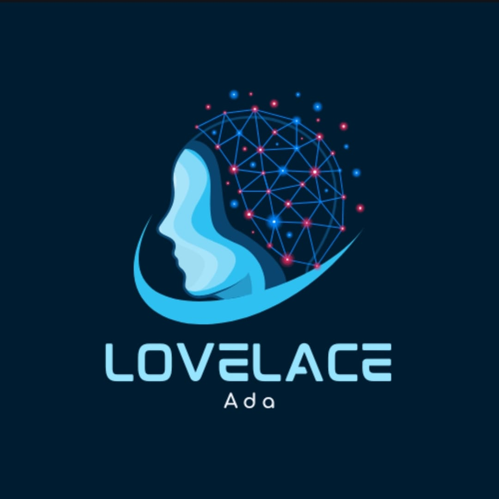

# Atlas - by Lovelace

<div align="center">
  <br><br>
</div>

Atlas is a comprehensive platform for managing travel risk alerts and assessments. This system enables users to seamlessly interact with database assets that store risk levels for various destinations. It's a tool that can be utilized by travel agents and organizations to plan trips and evaluate insurance policies to take. Atlas is a product for #MonkeyAndRiverHackathon2025

## Tech Stack

      

**Frontend:** React 
  - Provides a responsive and dynamic user interface for seamless user interaction

**Backend:** Node.js
  - Handles server-side logic, API endpoints, and database connectivity
  - Allows the creation of a simple, structured backend api using the express framework.

**Database:** PostgreSQL:
  - Robust relational database for storing travel risk data and user information
  - PostgreSQL provides the best of both Object-Oriented features, like inheritance, and the structure that traditional SQL brings.

## Atlas Features

### Authentication and Authorization
Secure user authentication system with role-based access control. Users can login, and access features. 

### Session Management
For our session management, we are using JWT tokens. In this approach, we are using the email and user id to sign the tokens.

### Risk Assessment Dashboard
Interactive dashboard displaying real-time travel risk levels for various destinations with color-coded alerts and timestamps.

### Notification System
Comprehensive subsystem for changes made in the database, including additions and deletions.

### User Profile & Preferences
User-friendly settings. Users can edit their profiles and customise their preferences.

## Pre-requisites

1. PostgreSQL 14 or later
2. Nodejs v22.5.1 or later

## Set Up and Run Atlas

1. Clone the repository

    ```bash
    git clone https://github.com/theaman249/2025-mnrhackathon-lovelace
    cd 2025-mnrhackathon-lovelace
    ```
2. Set up the database

    ```bash
    cd backend
    In the .env file, modify the following variables accordingly:
    - PG_USER_NAME: PostgreSQL server name user name
    - PG_HOST: host of your PostgreSQL instance host e.g. localhost
    - PG_PASSWORD: PostgreSQL instance password
    - PG_PORT: PostgreSQL instance's running port
    ```

3. Set up the backend and database scripts

    ```bash
    cd backend
    npm install
    npm run database_setup 
    node index.js
    ```

4. Set up the frontend directory - in a new terminal

    ```bash
    cd frontend
    npm install
    npm run dev 
    ```

## Interacting with the system

### login

For the login, please use:
 - email: jane@atlas.co.za
 - password: pass

### After login
Then interact with the system as was intended.


## Atlas Tests

-Unit and integration tests are done using Jest. 

-They test the authentication flow (login/logout, protected routes), database connection and basic CRUD operations.

-The tests are automated using Github actions. A worklfow script runs the tests when changes are pushed to the develop and main branches.


Test results:


To run the test suite:

```bash
# Backend tests
cd backend
npm test
```

## Meet the Team (a.k.a Lovelies)

| | |
|:---:|:---:|
| <br>**Agape Mamphasa**<br>*Backend Engineer, Integration Engineer*<br>BSc(Hons) Computer Science Graduate<br>[LinkedIn](https://www.linkedin.com/in/agape-mamphasa-92022a2a9/) \| [GitHub](https://github.com/theaman249) | <br>**Amanda Khuzwayo**<br>*Backend Engineer, Integration Engineer*<br>BSc(Hons) Computer Science Student<br>[LinkedIn](https://www.linkedin.com/in/amanda-khuzwayo-894130135/) \| [GitHub](https://github.com/Amanda9805) |
| <br>**Mbofho Mamatsharaga**<br>*Frontend Engineer, Integration Engineer*<br>BSc(Hons) Computer Science Student<br>[LinkedIn](https://www.linkedin.com/in/mbofho-mamatsharaga-54992823b/) \| [GitHub](https://github.com/TheStoryOfChampion) | <br>**Keabetswe Mothapo**<br>*Frontend Engineer, Integration Engineer*<br>BSc Information & Knowledge Systems Graduate<br>[LinkedIn](https://www.linkedin.com/in/keabetswe-mothapo/) \| [GitHub](https://github.com/keamothapo) |
